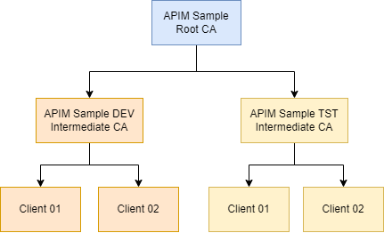

This blog post is the start of a series on how to work with client certificates in Azure API Management. In the series, I'll cover both the validation of client certificates in API Management and how to connect to backends using client certificates. 

While Azure's official documentation provides excellent guidance on setting up client certificates via the Azure Portal, this series takes it a step further. We'll dive into utilizing Bicep for Infrastructure as Code (IaC) and other essential tools, like the Azure CLI, to automate the entire deployment process.

Topics covered in this series:

- Validate client certificates in Azure API Management
- Using mTLS with an Azure Application Gateway and API Management
- Connection to backends using client certificates
- Deploying client certificates in Key Vault with Azure Pipeline 1/2
- Deploying client certificates in Key Vault with Azure Pipeline 2/2

In this first post, we'll cover the basics of how to validate client certificates in Azure API Management. We'll deploy both API Management and API using Bicep. We'll also have a look at how to upload CA certificates and client certificates.

If your interested in how to configure all this from the Azure Portal, have a look at [How to secure APIs using client certificate authentication in API Management].

### Prerequisites

This first section will cover the prerequisites required before we can start validating client certificates in Azure API Management.

#### Self-signed certificates

First things first. We need some certificates. Using [Generate and export certificates for point-to-site using PowerShell](https://learn.microsoft.com/en-us/azure/vpn-gateway/vpn-gateway-certificates-point-to-site) as a guide, I created the following three of certificates.



As you can see, we have one root CA certificate. Underneath it are two intermediate CA certificates that represent a development and test environment. Finally, we have two client certificates per environment.

I've created the script [generate-client-certificates.ps](https://github.com/ronaldbosma/blog-code-examples/blob/master/apim-client-certificate-series/00-self-signed-certificates/generate-client-certificates.ps1) to generate this certificate tree using PowerShell. It also exports all certificates in base64 encoded X.509 (.cer) files and additionally exports the client certificates with their private keys in PFX (.pfx) files. The results can be found in [this](https://github.com/ronaldbosma/blog-code-examples/tree/master/apim-client-certificate-series/00-self-signed-certificates/certificates) folder.

#### Deploy API Management

Next, we need an API Management instance. We'll be deploying everything using Bicep and the Azure CLI. The following script contains the bare minimum to create an API Management instance using Bicep. Save it in a file called `main.bicep`.

```bicep
//=============================================================================
// Parameters
//=============================================================================

@description('The name of the API Management Service that will be created')
param apiManagementServiceName string

@description('Location to use for all resources')
param location string = resourceGroup().location

@description('The email address of the owner of the API Management service')
param publisherEmail string

@description('The name of the owner of the API Management service')
param publisherName string

//=============================================================================
// Resources
//=============================================================================

// API Management
resource apiManagementService 'Microsoft.ApiManagement/service@2022-08-01' = {
  name: apiManagementServiceName
  location: location
  sku: {
    name: 'Developer'
    capacity: 1
  }
  properties: {
    publisherEmail: publisherEmail
    publisherName: publisherName
  }
}
```

As you can see, we're creating a Developer tier API Management instance. Normally for demos I'd use the Consumption tier because it's cheap and rolled out quickly. However, the Consumption tier does not support CA certificates, which we'll need later on.

Use the following command to deploy the API Management instance. Replace the `<placeholders>` with your values. This will take a while to complete (about ~30 minutes).

```powershell
az deployment group create `
    --name "deploy-$(Get-Date -Format "yyyyMMdd-HHmmss")" `
    --resource-group '<your-resource-group>' `
    --template-file './main.bicep' `
    --parameters apiManagementServiceName='<your-api-management-instance-name>' `
                 publisherEmail='<your-email>' `
                 publisherName='<your-name>' `
    --verbose
```

#### Deploy API

Once the API Management instance is deployed, we can create an API. The following Bicep creates an API called `client-cert-api` with two operations. Add it to the end of the `main.bicep`.

```bicep
// Client Cert API
resource clientCertApi 'Microsoft.ApiManagement/service/apis@2022-08-01' = {
  name: 'client-cert-api'
  parent: apiManagementService
  properties: {
    displayName: 'Client Cert API'
    path: 'client-cert'
    protocols: [ 
      'https' 
    ]
    subscriptionRequired: false
  }
}


// Operation to validate client certificate using validate-client-certificate policy
resource validateUsingPolicy 'Microsoft.ApiManagement/service/apis/operations@2022-08-01' = {
  name: 'validate-using-policy'
  parent: clientCertApi
  properties: {
    displayName: 'Validate (using policy)'
    description: 'Validates client certificate using validate-client-certificate policy'
    method: 'GET'
    urlTemplate: '/validate-using-policy'
  }

  resource policies 'policies' = {
    name: 'policy'
    properties: {
      format: 'rawxml'
      value: loadTextContent('./validate-using-policy.operation.cshtml') 
    }
  }
}


// Operation to validate client certificate using context.Request.Certificate property
resource validateUsingContext 'Microsoft.ApiManagement/service/apis/operations@2022-08-01' = {
  name: 'validate-using-context'
  parent: clientCertApi
  properties: {
    displayName: 'Validate (using context)'
    description: 'Validates client certificate using the context.Request.Certificate property'
    method: 'GET'
    urlTemplate: '/validate-using-context'
  }

  resource policies 'policies' = {
    name: 'policy'
    properties: {
      format: 'rawxml'
      value: loadTextContent('./validate-using-context.operation.cshtml') 
    }
  }
}
```

There are some things to take note off. First, I did not make the subscription key required to make testing the API as simple as possible. (This is not recommended for production scenarios.)

Second, both operations will load their respective policies from an XML file. Create a `validate-using-policy.operation.cshtml` and `validate-using-context.operation.cshtml` and add the following XML to both files.

  > The `.cshtml` extension is recognized by the [Azure API Management Extension for Visual Studio Code](https://marketplace.visualstudio.com/items?itemName=ms-azuretools.vscode-apimanagement) and among other things gives you some intellisense support on policies.

```xml
<policies>
    <inbound>
        <base />
        <return-response>
            <set-status code="200" />
            <set-body>@(context.Request.Certificate?.ToString())</set-body>
        </return-response>
    </inbound>
    <backend>
        <base />
    </backend>
    <outbound>
        <base />
    </outbound>
    <on-error>
        <set-header name="ErrorSource" exists-action="override">
            <value>@(context.LastError.Source)</value>
        </set-header>
        <set-header name="ErrorReason" exists-action="override">
            <value>@(context.LastError.Reason)</value>
        </set-header>
        <set-header name="ErrorMessage" exists-action="override">
            <value>@(context.LastError.Message)</value>
        </set-header>
        <base />
    </on-error>
</policies>
```

We haven't configured any backend to forward requests to, so the `return-response` policy will ensures that a `200 OK` response is always returned. By using the `context.Request.Certificate?.ToString()` policy expression, it will also include any details about a provided client certificate in the response body.

Finally, in the `on-error` section, we're setting some headers to return information about any errors that might occur. This will provide additional information about why a request failed.

> In a real-world scenario, you might not want to disclose this information to your clients. Instead, you would connect API Management to Application Insights so errors will be logged there.

Now redeploy the Bicep template using the previously provided Azure CLI command. This should take less than a minute to complete.


### Test API

After deploying the API, we can do a first test. I like to use the [REST Client extension for Visual Studio Code](https://marketplace.visualstudio.com/items?itemName=humao.rest-client). It allows me to quickly test APIs without having to leave my IDE.

> In this section I'll describe how to call the API with a client certificate using the extension. If you want to use Postman instead, you can follow the instructions in the following article: [Adding client certificates in Postman](https://learning.postman.com/docs/sending-requests/certificates/#adding-client-certificates). 
> 
> You can also call the API directly from the browser. You'll need to upload the client certificate with private key to your personal certificate store first. Then, when you browse to the full url of the API operation, you'll get a popup to select a client certificate. 

Create a file called `test.http` and add the following content. Replace `<your-api-management-instance-name>` with your API Management instance name.

```
# Configure your host name
@apimHostname = <your-api-management-instance-name>.azure-api.net

### Validates client certificate using validate-client-certificate policy
GET https://{{apimHostname}}/client-cert/validate-using-policy

### Validates client certificate using the context.Request.Certificate property
GET https://{{apimHostname}}/client-cert/validate-using-context
```

When you open the file in Visual Studio Code, you'll see a `Send Request` link above each request. Clicking it will send the request to the API. The response will be displayed in the output window. This should be a `200 OK` with and empty response body, because we haven't configured a client certificate yet.

You can use your own certificates or download samples from [certificates](https://github.com/ronaldbosma/blog-code-examples/tree/master/apim-client-certificate-series/00-self-signed-certificates/certificates).

To use the certificates, we'll need to update the user settings in Visual Studio Code as described [here](https://github.com/Huachao/vscode-restclient#ssl-client-certificates).
- Open the  Command Palette (`Ctrl+Shift+P`) and choose `Preferences: Open User Settings (JSON)`.
- Add the following configuration to the settings file. 

  ```json
  "rest-client.certificates": {
      "<your-api-management-instance-name>.azure-api.net": {
          "pfx": "<path-to-certificates>/dev-client-01.pfx",
          "passphrase": "P@ssw0rd"
      }
  }
  ```
  
- Replace `<your-api-management-instance-name>` with your API Management instance name and `<path-to-certificates>` with the path to the folder with certificates. 
- Don't forget to change the passphrase if you're using your own certificates.
- Save the changes.

Click on the `Send Request` link again in the `test.http` file. You should now get a `200 OK` response with the details of the client certificate in the response body. It should look something like this.

```
[Subject]
  CN=Client 01

[Issuer]
  CN=APIM Sample DEV Intermediate CA

[Serial Number]
  790CE8EEE5F01997408E859972D94A9E

[Not Before]
  10/27/2023 9:05:11 AM

[Not After]
  10/27/2024 9:15:11 AM

[Thumbprint]
  5E7FC1A1F7AD302EDFBFB0B87C5AF2A299B72858
```

