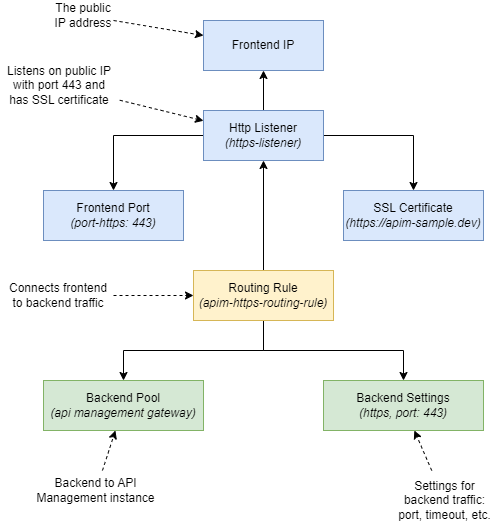
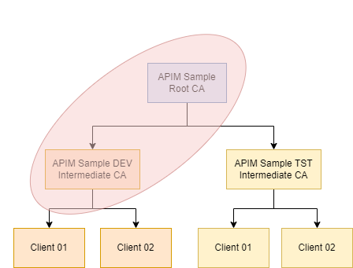
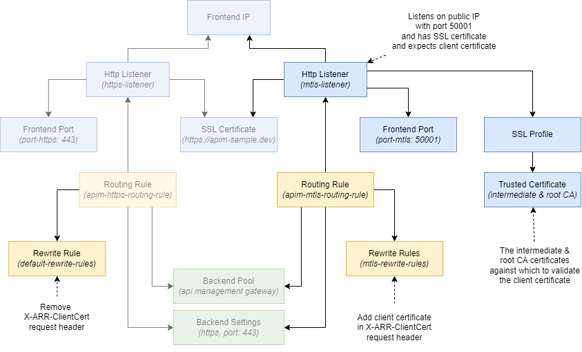

This post is the second in a series on how to work with client certificates in Azure API Management. In the series, I'll cover both the validation of client certificates in API Management and how to connect to backends with mTLS (mutual TLS) using client certificates.

While Azure's official documentation provides excellent guidance on setting up client certificates via the Azure Portal, this series takes it a step further. We'll dive into utilizing Bicep and other essential tools, like the Azure CLI, to automate the entire deployment process.

Topics covered in this series:

1. [Validate client certificates in API Management](/blog/2024/02/02/validate-client-certificates-in-api-management/)
1. Validate client certificates in API Management when its behind an Application Gateway _**(current)**_
1. Connect to backends using client certificates _(coming soon)_

### Intro

In this second post we build upon the solution of [the previous post](/blog/2024/02/02/validate-client-certificates-in-api-management/). We'll deploy API Management inside a virtual network behind an application gateway and configure the application gateway to validate client certificates. We'll also configure the application gateway to forward the client certificate to API Management for further validation.

This post provides a step-by-step guide. If you're interested in the end result, you can find it [here](https://github.com/ronaldbosma/blog-code-examples/tree/master/apim-client-certificate-series/02-validate-client-certificate-in-apim-behind-agw). _(Note that the deployment will take up to 45 minutes, because API Management will be deployed inside a virtual network.)_

The application gateway configuration outlined in this post can also be used in other situations. For example, when you have ASP.NET APIs hosted in App Services.

### Table of Contents

- [Prerequisites](#prerequisites)
  - [Network Security Group](#network-security-group)
  - [Virtual Network](#virtual-network)
  - [Deploy API Management in virtual network](#deploy-api-management-in-virtual-network)
  - [Public IP address](#public-ip-address)
  - [Deploy Application Gateway](#deploy-application-gateway)
- [Test API](#test-api)
- [Add mTLS listener to Application Gateway](#add-mtls-listener-to-application-gateway)

### Prerequisites

This first section will cover the prerequisites for this post. Use the result of the previous post as a starting point. You can find the code [here](https://github.com/ronaldbosma/blog-code-examples/tree/master/apim-client-certificate-series/01-validate-client-certificate-in-apim) and the self-signed certificates [here](https://github.com/ronaldbosma/blog-code-examples/tree/master/apim-client-certificate-series/00-self-signed-certificates).

We're going to deploy API Management inside a virtual network with the `internal` mode enabled, restricting access from external clients. To enable external access, we'll route traffic through an application gateway.

[Multiple compute platforms](https://learn.microsoft.com/en-us/azure/api-management/compute-infrastructure) are available for API Management. Since we're opting for the Developer tier, we have the choice between versions `stv1` and `stv2`. However, `stv1` will be retired in August 2024. Hence, for the purposes of this blog post, we'll be using `stv2`. This does mean configuring additional resources for API Management to work inside the virtual network. See [the documentation](https://learn.microsoft.com/en-us/azure/api-management/api-management-using-with-internal-vnet?tabs=stv2#prerequisites) for a comparison between the prerequisites for `stv1` and `stv2`.


> TODO: add a network image somewhere here...

#### Network Security Group

One of the first prerequisites is an NSG (Network Security Group) to allow inbound connectivity to API Management. The necessary rules that we'll be configuring can be found [here](https://learn.microsoft.com/en-us/azure/api-management/api-management-using-with-internal-vnet?tabs=stv2#configure-nsg-rules).

Open the `main.bicep` from the previous post and add the following Bicep:

```bicep
// Network Security Group for API Management subnet
resource apimNSG 'Microsoft.Network/networkSecurityGroups@2023-09-01' = {
  name: 'nsg-apim-validate-client-certificate'
  location: location
  properties: {
    securityRules: [
      {
        name: 'management-endpoint-for-azure-portal-and-powershell'
        properties: {
          access: 'Allow'
          sourcePortRange: '*'
          destinationPortRange: '3443'
          direction: 'Inbound'
          protocol: 'TCP'
          sourceAddressPrefix: 'ApiManagement'
          destinationAddressPrefix: 'VirtualNetwork'
          priority: 110
        }
      }
      {
        name: 'azure-infrastructure-load-balancer'
        properties: {
          access: 'Allow'
          sourcePortRange: '*'
          destinationPortRange: '6390'
          direction: 'Inbound'
          protocol: 'TCP'
          sourceAddressPrefix: 'AzureLoadBalancer'
          destinationAddressPrefix: 'VirtualNetwork'
          priority: 120
        }
      }
      {
        name: 'dependency-on-azure-storage'
        properties: {
          access: 'Allow'
          sourcePortRange: '*'
          destinationPortRange: '443'
          direction: 'Outbound'
          protocol: 'TCP'
          sourceAddressPrefix: 'VirtualNetwork'
          destinationAddressPrefix: 'Storage'
          priority: 140
        }
      }
      {
        name: 'access-to-azure-sql-endpoints'
        properties: {
          access: 'Allow'
          sourcePortRange: '*'
          destinationPortRange: '1433'
          direction: 'Outbound'
          protocol: 'TCP'
          sourceAddressPrefix: 'VirtualNetwork'
          destinationAddressPrefix: 'Sql'
          priority: 150
        }
      }
      {
        name: 'access-to-azure-key-vault'
        properties: {
          access: 'Allow'
          sourcePortRange: '*'
          destinationPortRange: '443'
          direction: 'Outbound'
          protocol: 'TCP'
          sourceAddressPrefix: 'VirtualNetwork'
          destinationAddressPrefix: 'AzureKeyVault'
          priority: 160
        }
      }
      {
        name: 'publish-diagnostics-logs-and-metrics-resource-health-and-application-insights'
        properties: {
          access: 'Allow'
          sourcePortRange: '*'
          destinationPortRange: '443'
          direction: 'Outbound'
          protocol: 'TCP'
          sourceAddressPrefix: 'VirtualNetwork'
          destinationAddressPrefix: 'AzureMonitor'
          priority: 170
        }
      }
    ]
  }
}
```

#### Virtual Network

Next, we'll need a virtual network for the application gateway and API management. Add the following Bicep to the `main.bicep` file:

```bicep
// Virtual Network
resource virtualNetwork 'Microsoft.Network/virtualNetworks@2023-05-01' = {
  name: 'vnet-validate-client-certificate'
  location: location
  properties: {
    addressSpace: {
      addressPrefixes: [
        '10.0.0.0/16'
      ]
    }
    subnets: [
      {
        name: 'snet-app-gateway'
        properties: {
          addressPrefix: '10.0.0.0/24'
        }
      }
      {
        name: 'snet-api-management'
        properties: {
          addressPrefix: '10.0.1.0/24'
          networkSecurityGroup: {
            id: apimNSG.id
          }
        }
      }
    ]
  }

  resource agwSubnet 'subnets' existing = {
    name: 'snet-app-gateway'
  }

  resource apimSubnet 'subnets' existing = {
    name: 'snet-api-management'
  }
}
```

This Bicep code will create a virtual network with two subnets: one for the application gateway and another for API Management. The latter is configured with the NSG. The code will also create a reference to the created subnets, so we can use their IDs later on.

This configuration is enough for this demo, but in a real-world scenario you probably want to add more security measures.

#### Public IP address for API Management

To deploy API Management in a virtual network, it also requires a public IP address. The public IP address is only used for management operations, because we're going to deploy API Management in `internal` mode. Add the following Bicep to the `main.bicep` file:

```bicep
// API Management Public IP address
resource apimPublicIPAddress 'Microsoft.Network/publicIPAddresses@2023-05-01' = {
  name: 'pip-apim-validate-client-certificate'
  location: location
  sku: {
    name: 'Standard'
  }
  properties: {
    publicIPAddressVersion: 'IPv4'
    publicIPAllocationMethod: 'Static'
    idleTimeoutInMinutes: 4
    dnsSettings: {
      // The label you choose to use does not matter but a label is required if this resource will be assigned to an API Management service.
      domainNameLabel: apiManagementServiceName
    }
  }
}
```

#### Deploy API Management in virtual network

We can now deploy API Management inside the virtual network. Locate the `apiManagementService` resource and add the following code to the properties section:

```bicep
virtualNetworkType: 'Internal'
virtualNetworkConfiguration: {
    subnetResourceId: virtualNetwork::apimSubnet.id
}
publicIpAddressId: apimPublicIPAddress.id
```

This will deploy API Management inside the virtual network and connect it to the subnet we created earlier. The `Internal` network type will make sure that API Management is not exposed outside the virtual network. It also configures the public IP address created in the previous step.

Deploying a new or existing API Management instance inside a virtual network can take up to **45 minutes**. So it's best to start the deployment now before proceeding. You can use the following Azure CLI command (same as previous post). Replace the `<placeholders>` with your values.

```powershell
az deployment group create `
    --name "deploy-$(Get-Date -Format "yyyyMMdd-HHmmss")" `
    --resource-group '<your-resource-group>' `
    --template-file './main.bicep' `
    --parameters apiManagementServiceName='<your-api-management-instance-name>' `
                 publisherEmail='<your-email>' `
                 publisherName='<your-name>' `
    --verbose
```

ERROR:
> The resource write operation failed to complete successfully, because it reached terminal provisioning state 'Failed'.
> Code: ActivationFailed
> Message: Unable to activate API service at this time. This could be temporary issue in the region. Please check https://aka.ms/azurestatus for any issues. If the issue persists after retry, please open a support case for your API management service using the Azure portal.


#### Public IP address

We'll need a public IP address for the application gateway. Add the following Bicep to the `main.bicep` file:

```bicep
// Public IP address
resource agwPublicIPAddress 'Microsoft.Network/publicIPAddresses@2023-05-01' = {
  name: 'pip-agw-validate-client-certificate'
  location: location
  sku: {
    name: 'Standard'
  }
  properties: {
    publicIPAddressVersion: 'IPv4'
    publicIPAllocationMethod: 'Static'
    idleTimeoutInMinutes: 4
  }
}
```

#### Deploy Application Gateway

Now we can configure the application gateway. We'll start with TLS before implementing mTLS. 

Add the following Bicep to the `main.bicep` file to create an application gateway.

```bicep
var applicationGatewayName = 'agw-validate-client-certificate'

// Application Gateway
resource applicationGateway 'Microsoft.Network/applicationGateways@2023-05-01' = {
  name: applicationGatewayName
  location: location
  properties: {
    sku: {
      name: 'Standard_v2'
      tier: 'Standard_v2'
    }
    enableHttp2: false
    autoscaleConfiguration: {
      minCapacity: 0
      maxCapacity: 2
    }

    gatewayIPConfigurations: [
      {
        name: 'agw-subnet-ip-config'
        properties: {
          subnet: {
            id: virtualNetwork::agwSubnet.id
          }
        }
      }
    ]
  }
}
```

As you can see, the application gateway is deployed in its designated subnet.

Next, we'll need to add several components to allow HTTPS traffic to the application gateway and route it to API Management. See the image below for a visual representation of the components that we'll be adding:




The configuration consists of three components:
1. The frontend (at the top) defines the IP address, specifies the protocol and port to use, and specifies the SSL certificate to use.
2. The backend (bottom part) outlines where requests should be forwarded to, specifying the protocol and port to use, timeouts, etc.
3. The routing rule in the middle connects the frontend and backend configurations.

See [Application gateway components](https://learn.microsoft.com/en-us/azure/application-gateway/application-gateway-components) for more information about the different components.

##### Frontend

Lets start with the frontend. Add the following Bicep code to the `properties` section of the application gateway:

```bicep
frontendIPConfigurations: [
  {
    name: 'agw-public-frontend-ip'
    properties: {
      publicIPAddress: {
        id: agwPublicIPAddress.id
      }
    }
  }
]

frontendPorts: [
  {
    name: 'port-https'
    properties: {
      port: 443
    }
  }
]

sslCertificates: [
  {
    name: 'agw-ssl-certificate'
    properties: {
      data: loadFileAsBase64('./ssl-cert.apim-sample.dev.pfx')
      password: 'P@ssw0rd'
    }
  }
]

httpListeners: [
  {
    name: 'https-listener'
    properties: {
      protocol: 'Https'
      hostName: 'apim-sample.dev'
      frontendIPConfiguration: {
        id: resourceId('Microsoft.Network/applicationGateways/frontendIPConfigurations', applicationGatewayName, 'agw-public-frontend-ip')
      }
      frontendPort: {
        id: resourceId('Microsoft.Network/applicationGateways/frontendPorts', applicationGatewayName, 'port-https')
      }
      sslCertificate: {
        id: resourceId('Microsoft.Network/applicationGateways/sslCertificates', applicationGatewayName, 'agw-ssl-certificate')
      }
    }
  }
]
```

As you can see, the frontend IP configuration is linked to the previously added public IP address. We'll be accepting traffic on the standard HTTPS port `443`, so we also configure an SSL certificate. The HTTP listener connects these parts together.

> In a real world scenario, we would add the SSL certificate to Key Vault and link to it from the `sslCertificates` configuration. For demo purposes, we'll upload it directly to the application gateway. In the next post of this series, we'll explore how to upload a PFX certificate to Key Vault and use it.


##### SSL Certificate

For this demo, I'm using a self-signed certificate. To create the SSL certificate, run the following PowerShell script in the same directory as your `main.bicep` file.

```powershell
# Settings
$dnsName = 'apim-sample.dev'
$plainTextPassword = 'P@ssw0rd'

# Create self-signed certificate
$params = @{
    DnsName = $dnsName
    CertStoreLocation = 'Cert:\CurrentUser\My'
}
$sslCertificate = New-SelfSignedCertificate @params

# Export the certificate with private key as .pfx file
$certificatePassword = ConvertTo-SecureString -String $plainTextPassword -Force -AsPlainText
Export-PfxCertificate -Cert $sslCertificate -FilePath "./ssl-cert.apim-sample.dev.pfx" -Password $certificatePassword
```

If you've modified the certificate password, file path, or filename, be sure to update the Bicep code accordingly. See [the documentation](https://learn.microsoft.com/en-us/powershell/module/pki/new-selfsignedcertificate?view=windowsserver2022-ps) for more information about the `New-SelfSignedCertificate` commandlet.

##### Backend

Next, we'll configure the backend. Add the following Bicep code to the `properties` section of the application gateway:

```bicep
backendAddressPools: [
  {
    name: 'apim-gateway-backend-pool'
    properties: {
      backendAddresses: [
        {
            ipAddress: apiManagementService.properties.privateIPAddresses[0]
        }
      ]
    }
  }
]

probes: [
  {
    name: 'apim-gateway-probe'
    properties: {
      pickHostNameFromBackendHttpSettings: true
      interval: 30
      timeout: 30
      path: '/status-0123456789abcdef'
      protocol: 'Https'
      unhealthyThreshold: 3
      match: {
        statusCodes: [
          '200-399'
        ]
      }
    }
  }
]

backendHttpSettingsCollection: [
  {
    name: 'apim-gateway-backend-settings'
    properties: {
      port: 443
      protocol: 'Https'
      cookieBasedAffinity: 'Disabled'
      hostName: '${apiManagementServiceName}.azure-api.net'
      requestTimeout: 20
      probe: {
        id: resourceId('Microsoft.Network/applicationGateways/probes', applicationGatewayName, 'apim-gateway-probe')
      }
    }
  }
]
```

The backend pool routes requests to backend servers. I've opted to use the private IP address of the API Management instance. More options can be found [here](https://learn.microsoft.com/en-us/azure/application-gateway/application-gateway-components#backend-pools).

The probe is used by the application gateway to monitor the health of all resources in a backend pool. In this case, we're using the `/status-0123456789abcdef` path, which is the default health endpoint provided by API Management.

The backend HTTP settings section, among other things, defines the port and protocol to use, the backend hostname and the associated health probe. 

It's important to note that the backend will use an SSL connection to communicate with API Management. However, it's currently not possible to use mTLS between the application gateway and a backend. Please refer to [the FAQ](https://learn.microsoft.com/en-us/azure/application-gateway/application-gateway-faq#is-mutual-authentication-available-between-application-gateway-and-its-backend-pools) for more details.

##### Request routing rule

The final step is to connect the frontend and backend. For this, we can use a request routing rule. Add the following Bicep code to the `properties` section of the application gateway:

```bicep
requestRoutingRules: [
  {
    name: 'apim-https-routing-rule'
    properties: {
      priority: 10
      ruleType: 'Basic'
      httpListener: {
        id: resourceId('Microsoft.Network/applicationGateways/httpListeners', applicationGatewayName, 'https-listener')
      }
      backendAddressPool: {
        id: resourceId('Microsoft.Network/applicationGateways/backendAddressPools', applicationGatewayName, 'apim-gateway-backend-pool')
      }
      backendHttpSettings: {
        id: resourceId('Microsoft.Network/applicationGateways/backendHttpSettingsCollection', applicationGatewayName, 'apim-gateway-backend-settings')
      }
    }
  }
]
```

##### Deploy

Deploy the application gateway using the Azure CLI command you've used before. The deployment will take about 5-7 minutes to complete.

### Test API

The application gateway can be reached on `https://apim-sample.dev`. However, because we've used a self-signed certificate and `apim-sample.dev` is not a registered domain, you'll have to update your hosts file to be able to reach the application gateway.

Locate the public IP address resource of the application gateway (`pip-agw-validate-client-certificate`) in the Azure Portal, open it and copy the IP address. Open your hosts file (`C:\Windows\System32\drivers\etc\hosts` on Windows, `/private/etc/hosts` on Mac or `/etc/hosts` on Linux) and add the following line, replacing `<your-public-ip-address>` with the IP address you copied.

```
<your-public-ip-address> apim-sample.dev
```

Now you can test if everything is configured correctly. Save the following snippet in an `.http` file and open it in Visual Studio Code with the [REST Client extension](https://marketplace.visualstudio.com/items?itemName=humao.rest-client). Click the `Send Request` link to send the request.

```
### Test that API Management can be reached (/status-0123456789abcdef is a default endpoint you can use)

GET https://apim-sample.dev/status-0123456789abcdef
```

This request will call the `/status-0123456789abcdef` endpoint, which is a default endpoint you can use to test if API Management is reachable. If everything is configured correctly, you should get a `200 OK` response.


### Add mTLS listener to Application Gateway

Scope of validation:  



Components to deploy:  



#### Port

Add the following to the `frontendPorts` array:

```bicep
{
  name: 'port-mtls'
  properties: {
    port: 53029
  }
}
```

In this demo we haven't configured any NSG rules. If you have stricter configuration, you might also need to allow inbound traffic on port `53029`.

#### Trusted Certificates

The the following Bicep to the `properties` section of the `applicationGateway` resource. Replace `<path-to-certificates>` with the path to the certificate.

```bicep
trustedClientCertificates: [
  {
    name: 'intermediate-ca-with-root-ca'
    properties: {
      data: loadTextContent('<path-to-certificates>/dev-intermediate-ca-with-root-ca.cer')
    }
  }
]
```

The root CA certificate must be marked as root certificate. 

#### SSL Profile

The the following Bicep to the `properties` section of the `applicationGateway` resource.

```bicep
sslProfiles: [
  {
    name: 'mtls-ssl-profile'
    properties: {
      clientAuthConfiguration: {
        // By setting verifyClientCertIssuerDN to true the intermediate CA is also checked, not just the Root CA.
        // See https://learn.microsoft.com/en-us/azure/application-gateway/mutual-authentication-overview?tabs=powershell#verify-client-certificate-dn
        verifyClientCertIssuerDN: true
      }
      trustedClientCertificates: [
        {
          id: resourceId('Microsoft.Network/applicationGateways/trustedClientCertificates', applicationGatewayName, 'intermediate-ca-with-root-ca')
        }
      ]
    }
  }
]
```

If we don't set `verifyClientCertIssuerDN` to true, only the root CA certificate will be checked. In our example, this would mean that a client certificate created by `CN=APIM Sample TST Intermediate CA` would be accepted, even though we've uploaded the other intermediate certificate `CN=APIM Sample DEV Intermediate CA`. By setting `verifyClientCertIssuerDN` to true, the intermediate certificate will also be checked and only certificates created by `CN=APIM Sample DEV Intermediate CA` will be accepted.


#### mTLS Listener

Add the following to the `httpListeners` array:

```bicep
{
  name: 'mtls-listener'
  properties: {
    protocol: 'Https'
    hostName: 'apim-sample.dev'
    frontendIPConfiguration: {
      id: resourceId('Microsoft.Network/applicationGateways/frontendIPConfigurations', applicationGatewayName, 'agw-public-frontend-ip')
    }
    frontendPort: {
      id: resourceId('Microsoft.Network/applicationGateways/frontendPorts', applicationGatewayName, 'port-mtls')
    }
    sslCertificate: {
      id: resourceId('Microsoft.Network/applicationGateways/sslCertificates', applicationGatewayName, 'agw-ssl-certificate')
    }
    sslProfile: {
      id: resourceId('Microsoft.Network/applicationGateways/sslProfiles', applicationGatewayName, 'mtls-ssl-profile')
    }
  }
}
```

#### Routing Rule

Add the following to the `requestRoutingRules` array:

```bicep
{
  name: 'apim-mtls-routing-rule'
  properties: {
    priority: 30
    ruleType: 'Basic'
    httpListener: {
      id: resourceId('Microsoft.Network/applicationGateways/httpListeners', applicationGatewayName, 'mtls-listener')
    }
    backendAddressPool: {
      id: resourceId('Microsoft.Network/applicationGateways/backendAddressPools', applicationGatewayName, 'apim-gateway-backend-pool')
    }
    backendHttpSettings: {
      id: resourceId('Microsoft.Network/applicationGateways/backendHttpSettingsCollection', applicationGatewayName, 'apim-gateway-backend-settings')
    }
  }
}
```

#### Test mTLS

Add the following snippet to your `.http` file. Try sending the requests.

```
### Test that API Management can be reached

GET https://apim-sample.dev:53029/status-0123456789abcdef


### Validates client certificate using validate-client-certificate policy

GET https://apim-sample.dev:53029/client-cert/validate-using-policy


### Validates client certificate using the context.Request.Certificate property

GET https://apim-sample.dev:53029/client-cert/validate-using-context
```

All request will fail with a response similar to the one below because we haven't configured the REST Client extension to send a client certificate yet.

```
HTTP/1.1 400 Bad Request
Server: Microsoft-Azure-Application-Gateway/v2

<html>
<head><title>400 No required SSL certificate was sent</title></head>
<body>
<center><h1>400 Bad Request</h1></center>
<center>No required SSL certificate was sent</center>
<hr><center>Microsoft-Azure-Application-Gateway/v2</center>
</body>
</html>
```

To send a client certificate, we'll need to update the user settings in Visual Studio Code as described [here](https://github.com/Huachao/vscode-restclient#ssl-client-certificates).

- Open the  Command Palette (`Ctrl+Shift+P`) and choose `Preferences: Open User Settings (JSON)`.
- Add the following configuration to the settings file.  
  _(If you've followed along with the previous post, the `rest-client.certificates` section should already exist.)_

  ```json
  "rest-client.certificates": {
    "apim-sample.dev:53029": {
      "pfx": "<path-to-certificates>/dev-client-01.pfx",
      "passphrase": "P@ssw0rd"
    }
  }
  ```
  
- Don't forget to change the passphrase if you're using your own certificates.
- Save the changes.

Now if you send the request to `/status-0123456789abcdef` it should succeed. If you use a client certificate from another intermediate CA like `tst-client-01.pfx`, a `400 Bad Request` is returned again.

The calls to `/client-cert/validate-using-policy` and `/client-cert/validate-using-context` still fail, even when a valid client certificate is passed. They both return a `401`. The reason for this is that the client certificate is not sent to API Management. The application gateway terminates the mTLS session as described on [Overview of TLS termination and end to end TLS with Application Gateway](https://learn.microsoft.com/en-us/azure/application-gateway/ssl-overview). This means that we can't use the `validate-client-certificate` policy or the `context.Request.Certificate` property.


### Forward client certificate to API Management

Using a rewrite rule, we can access the client certificate through the `client_certificate` server variable. We can then forward the client certificate to API Management using a header. See [Rewrite HTTP headers and URL with Application Gateway - Mutual authentication server variables](https://learn.microsoft.com/en-us/azure/application-gateway/rewrite-http-headers-url#mutual-authentication-server-variables) for more information.

We'll use `X-ARR-ClientCert` as the name for the header. This is a common name that is also used in similar scenarios. Azure App Services for example uses this header to pass a client certificate to an app like an ASP.NET Web API. _(See [Configure TLS mutual authentication for Azure App Service - Access client certificate](https://learn.microsoft.com/en-us/azure/app-service/app-service-web-configure-tls-mutual-auth?tabs=azurecli#access-client-certificate) for more details if you're interested in this scenario._)

To forward the client certificate, add the following Bicep to the `properties` section of the `applicationGateway` resource:

```bicep
rewriteRuleSets: [
  {
    name: 'mtls-rewrite-rules'
    properties: {
      rewriteRules: [
        {
          ruleSequence: 100
          conditions: []
          name: 'Add Client certificate to HTTP header'
          actionSet: {
            requestHeaderConfigurations: [
              {
                headerName: 'X-ARR-ClientCert'
                headerValue: '{var_client_certificate}'
              }
            ]
            responseHeaderConfigurations: []
          }
        }
      ]
    }
  }
]
```

Locate the `apim-mtls-routing-rule` routing rule and add a reference to the new `mtls-rewrite-rules` rewrite rule set using the following Bicep.

```bicep
rewriteRuleSet: {
  id: resourceId('Microsoft.Network/applicationGateways/rewriteRuleSets', applicationGatewayName, 'mtls-rewrite-rules')
}
```

To test that the client certificate is forwarded to API Management, we'll add a new operation. First, create a file called `validate-from-agw.operation.cshtml` and add the following policies. This will return a `200 OK` with the passed client certificate in the response body. If no client certificate was forwarded, the text `No client certificate passed` will be returned.

```xml
<policies>
    <inbound>
        <base />
        <return-response>
            <set-status code="200" />
            <set-body>@(context.Request.Headers.GetValueOrDefault("X-ARR-ClientCert", "No client certificate passed"))</set-body>
        </return-response>
    </inbound>
    <backend>
        <base />
    </backend>
    <outbound>
        <base />
    </outbound>
    <on-error>
        <base />
    </on-error>
</policies>
```

Add the following Bicep so the new operation is deployed to the `clientCertApi` API.

```bicep
// Operation to validate client certificate received from Application Gateway
resource validateFromAppGateway 'Microsoft.ApiManagement/service/apis/operations@2022-08-01' = {
  name: 'validate-from-agw'
  parent: clientCertApi
  properties: {
    displayName: 'Validate (from AGW)'
    description: 'Validates client certificate received from Application Gateway'
    method: 'GET'
    urlTemplate: '/validate-from-agw'
  }

  resource policies 'policies' = {
    name: 'policy'
    properties: {
      format: 'rawxml'
      value: loadTextContent('./validate-from-agw.operation.cshtml') 
    }
  }
}
```

Deploy the changes. After the deployment, use the following request to test the ne operation. 

```
### mTLS (should return the X-ARR-ClientCert header value and certificate details)

GET https://apim-sample.dev:53029/client-cert/validate-from-agw
```

The result should look similar to the response below (I've truncated the response body). 

```
HTTP/1.1 200 OK

-----BEGIN%20CERTIFICATE-----%0AMIIDRTCCAi.....6Zdlr9V53Q%3D%3D%0A-----END%20CERTIFICATE-----%0A
```

The response body is the value of the `X-ARR-ClientCert` header. The value is the `Base-64 encoded X.509 (.CER)` representation of the client certificate without the private key. Special characters, like the white spaces, are URL encoded.


### Other

If you deploy this solution to an Azure subscription with limited credits, take note that both the virtual network and application gateway are not cheap. It's best to remove everything after you're done. If you want to keep the solution around a little longer, you can stop the application gateway. This will stop the billing.

To stop the application gateway, use the following Azure CLI command:

```powershell
az network application-gateway stop --name 'agw-validate-client-certificate' --resource-group '<your-resource-group>'
```

And you can start it again with the following Azure CLI command:

```powershell
az network application-gateway start --name 'agw-validate-client-certificate' --resource-group '<your-resource-group>'
```