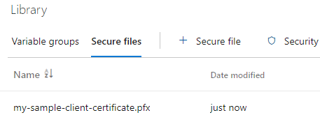

Azure API Management is a powerful service that enables you to expose, secure, and manage APIs. In some scenarios, you may need to connect to a backend system that is secured with mutual Transport Layer Security (mTLS). This blog post will guide you through the process of creating an Azure Pipeline that imports a client certificate into Azure Key Vault and use it with Azure API Management.

On [Secure backend services using client certificate authentication in Azure API Management](https://learn.microsoft.com/en-us/azure/api-management/api-management-howto-mutual-certificates) Microsoft already gives a good explanation on how to configure mTLS in Azure API Management. In this blog post, we'll focus on how to automate the process using an Azure Pipeline.

### Prerequisites

For this solution to work, you'll need an Azure API Management instance and a Key Vault. The can give the API Management instance access to the Key Vault by enable RBAC Authorization and assigning the API Management identity the 'Key Vault Secrets User' role. See [Secure backend services using client certificate authentication in Azure API Management](https://learn.microsoft.com/en-us/azure/api-management/api-management-howto-mutual-certificates) for a detailed explanation.

I've created a Bicep script that creates the required resources and a PowerShell script to run it. You can find them [here](https://github.com/ronaldbosma/blog-code-examples/blob/master/deploy-apim-client-certificate-in-key-vault-with-azure-pipeline/prerequisites/README.md).


### Azure Pipeline

This post assumes you have experience creating Azure Pipelines. If not, have a look at [Create your first pipeline](https://learn.microsoft.com/en-us/azure/devops/pipelines/create-first-pipeline?view=azure-devops&tabs=java%2Ctfs-2018-2%2Cbrowser) first.

Let's start with a couple of variables that we'll use throughout the pipeline. Replace the placeholders with your own values.

```yaml
trigger: none

jobs:
- job: deploy
  variables:
    azureServiceConnection: '<your-azure-service-connection>'
    keyVaultName: '<your-key-vault-name>'
    clientCertificateName: '<client-certificate-name>'
    clientCertificatePassword: '<client-certificate-password>' # Should be a secret variable
```

The `clientCertificateName` variable will be used as the name of the certificate in Key Vault. The `clientCertificatePassword` variable will be used to import the certificate with its private key. Normally this would be a secret in e.g. a variable group, but for the sake of this example, I've put it directly in the pipeline.

#### Secure File

The client certificate has a private key that needs to be protected. We can protect it by storing the certificate in the Secure files library of Azure DevOps. Secure files are encrypted and can only be used in a pipeline by referencing them in a task. See [Secure files](https://docs.microsoft.com/en-us/azure/devops/pipelines/library/secure-files?view=azure-devops&tabs=yaml) for more information.

Click on the Library menu item under Pipelines and open the Secure files tab. Upload your secure file. The result should look like the following image:



You'll also need to give your pipeline permission to access the secure file. Follow these steps:

1. Open the Secure file
1. Click the 'Pipeline permissions' button
1. Add your pipeline

In our pipeline, we can reference the secure file using the [DownloadSecureFile](https://docs.microsoft.com/en-us/azure/devops/pipelines/tasks/utility/download-secure-file?view=azure-devops) task. The task will download the certificate in the `$(Agent.TempDirectory)` directory. See the example below:

```yaml
- task: DownloadSecureFile@1
  name: clientCertificate
  displayName: 'Download Client Certificate from Secure files library'
  inputs:
    secureFile: 'my-sample-client-certificate.pfx'
```

We can access the path to the secure file using the `$(clientCertificate.secureFilePath)` variable. Where `clientCertificate` is the name of the task. 

#### Import Client Certificate

Now that we've stored the client certificate in the Secure files library, we can import it into Key Vault. Since I use Bicep to create most of my Azure resources, I wanted to import the client certificate using Bicep. Unfortunately, Bicep only supports adding secrets and keys, not certificates. We can however use the Azure CLI or PowerShell as described on [Tutorial: Import a certificate in Azure Key Vault](https://learn.microsoft.com/en-us/azure/key-vault/certificates/tutorial-import-certificate?tabs=azure-cli).

We can use the `AzureCLI` task as follows to import the certificate.

```yaml
- task: AzureCLI@2
  displayName: "Import Client Certificate into Key Vault"
  inputs:
    azureSubscription: '${{ variables.azureServiceConnection }}'
    scriptType: 'pscore'
    scriptLocation: 'inlineScript'
    inlineScript: |
    az keyvault certificate import `
        --file '$(clientCertificate.secureFilePath)' `
        --vault-name '$(keyVaultName)' `
        --name '$(clientCertificateName)' `
        --password '$(clientCertificatePassword)'
```

It's important to note that a secret and certificate in Key Vault can not have the same name. If you try to import a certificate with the same name as an existing secret, you'll get an error.

If you execute the pipeline now, you might get the following error:

```
Code: Forbidden
Message: Caller is not authorized to perform action on resource.
If role assignments, deny assignments or role definitions were changed recently, please observe propagation time.
Caller: appid=***;oid=<your-service-connection-principal-id>;iss=https://sts.windows.net/<your-azure-tenant-id>/
Action: 'Microsoft.KeyVault/vaults/certificates/import/action'
Resource: '/subscriptions/<your-subscription-id>/resourcegroups/<your-resource-group-name>/providers/microsoft.keyvault/vaults/<your-key-vault-name>/certificates/<your-certificate-name>'
Assignment: (not found)
DecisionReason: 'DeniedWithNoValidRBAC' 
Vault: <your-key-vault-name>;location=<your-location>

Inner error: {
    "code": "ForbiddenByRbac"
}
```

The error message tells us that the service connection principal is not authorized to perform the action. In my case, the service connection had the [Contributor](https://learn.microsoft.com/en-us/azure/role-based-access-control/built-in-roles#contributor) role. This role does not have the data action `Import Certificate`, which is required to import a certificate containing a private key in either PFX or PEM format.

We can fix this by assigning the service connection the built-in role [Key Vault Certificates Officer](https://learn.microsoft.com/en-us/azure/role-based-access-control/built-in-roles#key-vault-certificates-officer) (id: `a4417e6f-fecd-4de8-b567-7b0420556985`). Use the following Azure CLI command. Replace the placeholders with your own values that you can find in the error message.

```powershell
az role assignment create `
    --role "a4417e6f-fecd-4de8-b567-7b0420556985" `
    --assignee-object-id "<your-service-connection-principal-id>" `
	--assignee-principal-type ServicePrincipal `
    --scope "/subscriptions/<your-subscription-id>/resourcegroups/<your-resource-group-name>/providers/microsoft.keyvault/vaults/<your-key-vault-name>"
```

The pipeline should now run successfully.

> If the role 'Key Vault Certificates Officer' has to much permissions for your scenario, you can create a custom role with the required permissions. See [Azure custom roles](https://learn.microsoft.com/en-us/azure/role-based-access-control/custom-roles) for more information.

### Pipeline Template

>TODO: describe template multi environment setup

There are a couple of things to note here. Variable groups are a great way to define environment specific variables. You can create a variable group per environment and reference it in the corresponding stage of your pipeline. However, it's not possible to link a secure file to a variable group. So if you have a different client certificate per environment, you'll have to create a separate secure file for each environment.

Also, the value of the `secureFile` input of the `DownloadSecureFile` task can not be specified by a variable.