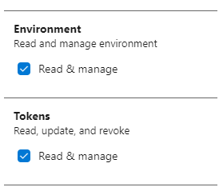
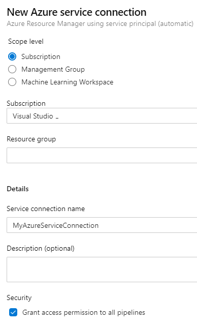
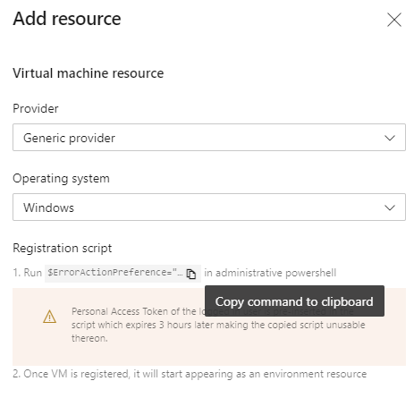

In the past I've written the post [How to install .NET Core on a Windows server](https://ronaldbosma.github.io/blog/2020/05/07/how-to-install-.net-core-on-a-windows-server/) where I talked about a custom Azure Pipelines task that I've build. To test this task in an actual pipeline I used an Azure virtual machine that I created manually and kept around for this specific purpose. Everytime I wanted to test something I had to start the machine, test my task, log on to the server and check if .NET Core was installed successfully. If I wanted to test a clean install I had to uninstall .NET Core first. Which meant installing 3 different pieces of software for each supported .NET Core version.

As you can see, a lot of manual steps were involved. So I automated this. I've created a pipeline that:
1. Creates an Azure Pipelines environment in Azure DevOps.
1. Provisions a fresh virtual machine in Azure.
1. Registers the virtual machine in the Azure Pipelines environment.
1. Runs my custom task & verifies that the installation is successful.
1. Deletes the Azure Pipelines environment.
1. Deletes the Azure virtual machine.

In the rest of this post I'll explain how [this pipeline](https://github.com/ronaldbosma/blog-code-examples/blob/master/ProvisionAzureVMInAzurePipelinesEnvironment/provision-vm-in-environment-azure-pipeline.yml) works.

### Table of contents

- [Prerequisites](#prerequisites)
  - [Create Personal Access Token](#create-personal-access-token)
  - [Create Azure Resource Manager service connection](#create-azure-resource-manager-service-connection)
- [Pipeline variables](#pipeline-variables)
- [Provision Azure virtual machine in environment](#provision-azure-virtual-machine-in-environment)
  - [Provision the Azure virtual machine](#provision-the-azure-virtual-machine)
  - [Register the virtual machine in the environment](#register-the-virtual-machine-in-the-environment)
- [Run task on provisioned virtual machine](#run-task-on-provisioned-virtual-machine)
- [Cleanup](#cleanup)
  - [Delete the Azure Pipelines environment](#delete-the-azure-pipelines-environment)
  - [Delete the Azure virtual machine](#delete-the-azure-virtual-machine)

### Prerequisites

To make the pipeline work you'll need to create a Personal Access Token and an Azure Resource Manager service connection to connect to your Azure subscription.

#### Create Personal Access Token

Follow these steps to create a Personal Access Token (see [create a PAT](https://docs.microsoft.com/en-us/azure/devops/organizations/accounts/use-personal-access-tokens-to-authenticate?view=azure-devops&tabs=preview-page#create-a-pat) for more info):
1. Log in to you Azure DevOps organization and open your team project.
1. Open the user settings menu in the top right corner en choose 'Personal access tokens'.
1. Choose New Token.
1. Click the show all scopes link.
1. Give the token access to the scopes 'Environment (Read & manage)' and 'Tokens (read & manage)'.  
  
  <!--  -->
1. Click on Create.
1. Copy the token so you can use it later on.

To 'Environment (Read & manage)' scope is required to register the virtual machine in the environment. The 'Tokens (read & manage)' scope is required to delete the environment at the end of the pipeline, which doesn't really seemed logical to me. But we're using the `az devops invoke` Azure CLI command which fails without this scope.

### Create Azure Resource Manager service connection

We're going to use the Azure CLI task in our pipeline which requires an Azure Resource Manager service connection. Follow these steps to create the service connection (see [Connect to Microsoft Azure](https://docs.microsoft.com/en-us/azure/devops/pipelines/library/connect-to-azure?view=azure-devops) for more info):

1. Log in to you Azure DevOps organization and open your team project.
1. Open the Project setting in the left bottom corner.
1. Under Service connections choose New service connection.
1. Select Azure Resource Manager as the type.
1. Choose Service principal (automatic) as the authentication method.
1. In my case it automatically found my subscription connected to my Azure DevOps account.
1. Leave the resource group empty (we're going to create a new one).
1. Give it a name like MyAzureServiceConnection and choose Save.  
  
  <!--  -->

### Pipeline variables

After setting up the prerequisites we can start with the YAML pipeline. The pipeline starts with the variables section.

I wanted to give the Azure Pipelines environment a random name so I can run multiple instances of the pipeline in parallel without them interfering with eachother. I introduced the `environmentName` variable for this purpose.

```yaml
variables:
  environmentName: "provision-vm-example-${{ variables['Build.SourceVersion'] }}"
  adminPassword: "Password12345!"
  token: "my-token"
```

I tried adding the `Build.BuildNumber` variable as the postfix for the environment name to make it unique but it didn't work. The environment name that you use in deployment jobs (which we'll use in the second stage) needs to be available during pipeline intialization. And runtime variables like `Build.BuildNumber` can't be used during this time. So I settled for the `Build.SourceVersion` variable which contains the latest Git commit ID.

> If you want to know which variables are available during pipeline initialization. Go to the [Use predefined variables](https://docs.microsoft.com/en-us/azure/devops/pipelines/build/variables?view=azure-devops&tabs=yaml) page. Every variable with a Yes in the 'Available in templates?' column can be used this way.

The `adminPassword` is used for the Administrator password of the virtual machine we'll create. The `token` variable should be set with the value of the token you created in the prerequisites. For demo purposes I hardcoded these in the example but you should ofcourse add these as secret variables to your pipeline or use some kind of secrets store.

### Provision Azure virtual machine in environment

The first stage in the pipeline will provision the Azure virtual machine and register the VM in the environment. The start of this stage looks as follows:

```yaml
stages:
- stage: Provision
  jobs:
  - job:
    steps:
    - task: AzureCLI@2
      inputs:
        azureSubscription: 'MyAzureSubscription'
        scriptType: pscore
        scriptLocation: inlineScript
        inlineScript: |
        
```

We're using the [Azure CLI task](https://docs.microsoft.com/en-us/azure/devops/pipelines/tasks/deploy/azure-cli?view=azure-devops) with an inline PowerShell script to create the various resources in Azure through the MyAzureSubscription service connection we created earlier. I've chosen Azure CLI for its simplicity and because it has an extension which allows me to also interact Azure DevOps.

#### Provision the Azure virtual machine

The first command of the Azure CLI script is to create a resource group. I'm using the same name as the environment so we can easily match the two.

```powershell
az group create --name $(environmentName) --location westeurope;
```

Next we create the virtual machine. With this command a Windows Server 2019 VM will be created in the resource group.

```powershell
az vm create `
  --name ProvisionedVM `
  --image Win2019Datacenter `
  --admin-password "$(adminPassword)"`
  --resource-group $(environmentName);
```
The name of the virtual machine will be `ProvisionedVM`. The max length of the name is 15 characters.

The admin password is a required parameter. Notice I haven't provided a name for the admin user. If you don't provide the username the admin username will match the name of the user running the Azure CLI command. Which in this case will be `vsts`.

#### Register the virtual machine in the environment

The last step is to register the newly created virtual machine in our Azure Pipelines environment. You might think _"Don't we need to create the Azure Pipelines environment first?"_. The answer is no. If you use a deployment job in a YAML pipeline and bind it to a non-existing environment Azure DevOps will create the environment for you.

To manually register a virtual machine in an environment, you would go to the environment in Azure DevOps, choose to add a new Virtual Machine resource, copy a PowerShell script (see image below) and execute the script on the virtual machine.


<!--  -->

To automate these steps we need that PowerShell script. So I copied it from the Azure DevOps portal and saved it on GitHub in a file called [register-server-in-environment.ps1](https://github.com/ronaldbosma/blog-code-examples/blob/master/ProvisionAzureVMInAzurePipelinesEnvironment/register-server-in-environment.ps1). To be able to call it from our pipeline I've maded the following changes:

- Add parameters to the script to specify the Azure DevOps organization, team project, environment, personal access token and optional tags to use.
- Download the latest .zip file with the agent to install.  
  The copied PowerShell script downloads a .zip file with the agent from a url with a hardcoded version. I've added some code to always download the latest version.
- Add the `--unattendend` flag when calling the `.\config.cmd` script.
- Add the agent number to the agent name, so you can install multiple agents on 1 virtual machine if you want.
- Raise an exception if registration of the agent in the environment fails.

To run this script on the Azure virtual machine we can use a custom script extension as described on [Custom Script Extension for Windows](https://docs.microsoft.com/nl-nl/azure/virtual-machines/extensions/custom-script-windows).

> If you want to add an Azure virtual machine to a deployment group instead of an environment you use the existing Azure Pipelines Agent extension instead of using a custom PowerShell script. Have a look at [Provision deployment group agents](https://docs.microsoft.com/en-us/azure/devops/pipelines/release/deployment-groups/howto-provision-deployment-group-agents?view=azure-devops) for more information.

We can use the `az vm extension set` CLI command to execute the custom script extension. The script either already needs to be on the server or accessible on the internet for download. The command takes a settings JSON that should look like this:

```json
{
    "fileUris": [
        "https://raw.githubusercontent.com/ronaldbosma/blog-code-examples/master/ProvisionAzureVMInAzurePipelinesEnvironment/register-server-in-environment.ps1"
    ],
    "commandToExecute": "powershell.exe ./register-server-in-environment.ps1 -OrganizationUrl '$(System.CollectionUri)' -TeamProject '$(System.TeamProject)' -Environment '$(environmentName)' -Token '$(token)'"
}
```

In the JSON you specify the uris to any files you want to download and the command you want to execute. As you can see we're calling the [register-server-in-environment.ps1](https://github.com/ronaldbosma/blog-code-examples/blob/master/ProvisionAzureVMInAzurePipelinesEnvironment/register-server-in-environment.ps1) passing in the organization, team project, environment and token (tags are optional).

I advice you to make a copy of the [register-server-in-environment.ps1](https://github.com/ronaldbosma/blog-code-examples/blob/master/ProvisionAzureVMInAzurePipelinesEnvironment/register-server-in-environment.ps1) script and host it on your own GitHub. Use the 'raw' url to the script in the settings JSON or you'll be downloading an HTML page from GitHub. Which won't work, trust me...

To register the Azure virtual machine in our Azure pipelines environment we can add the following code to our inline script.

```powershell
$customScriptUri = "https://raw.githubusercontent.com/ronaldbosma/blog-code-examples/master/ProvisionAzureVMInAzurePipelinesEnvironment/register-server-in-environment.ps1";
$customScriptSettings="{`\`"fileUris`\`":[`\`"$customScriptUri`\`"], `\`"commandToExecute`\`":`\`"powershell.exe ./register-server-in-environment.ps1 -OrganizationUrl '$(System.CollectionUri)' -TeamProject '$(System.TeamProject)' -Environment '$(environmentName)' -Token '$(token)'`\`"}";

az vm extension set `
  --name CustomScriptExtension `
  --publisher Microsoft.Compute `
  --vm-name ProvisionedVM `
  --resource-group $(environmentName) `
  --settings $customScriptSettings;
```

With these steps the first stage is done and the pipeline can provision a virtual machine in Azure and register it in an Azure Pipelines environment.

If you have a pipeline with only this stage and you run it, the registration will fail because the environment will not be automatically created by Azure DevOps. So you'll need to created it manually or add a stage with a deployment job. Which is we'll do next.

### Run task on provisioned virtual machine

In the second stage we're going to use the environment with the newly provisioned Azure virtual machine. It's fairly straightforward if you already have experience with deployment jobs. Here's the YAML snippet:

```yaml
- stage: Test
  dependsOn: Provision
  condition: succeeded()
  jobs:
  - deployment: TestCustomTask
    environment:
      name: '$(environmentName)'
      resourceType: VirtualMachine
    strategy:
      runOnce:
        deploy:
          steps:
          - task: InstallNetCoreRuntimeAndHosting@1
            inputs:
              version: '6.0'
              iisReset: false
              norestart: true
```

The stage depends on the `Provision` stage to succeed before executing. It's bound to the environment with the provisioned Azure virtual machine through the `$(environmentName)` variable.

In this example my custom task `InstallNetCoreRuntimeAndHosting` is executed on the virtual machine. It will install the latest .NET Runtime & Hosting bundle for .NET 6.0. Which currently is in preview. You can ofcourse execute whatever tasks or jobs you want.

### Cleanup

After the test stage the Azure virtual machine and Azure Pipelines environment are no longer needed so we can remove them. We're using the [Azure CLI task](https://docs.microsoft.com/en-us/azure/devops/pipelines/tasks/deploy/azure-cli?view=azure-devops) again. Here's the start of the third stage.

```yaml
- stage: Cleanup
  dependsOn: Test
  condition: succeeded()
  jobs:
  - job:
    steps:
    - task: AzureCLI@2
      inputs:
        azureSubscription: 'MyAzureSubscription'
        scriptType: pscore
        scriptLocation: inlineScript
        inlineScript: |
```

It's similar to the start of the `Provision` stage. It only has another name and depends on the `Test` stage to succeed before executing.

#### Delete the Azure Pipelines environment

The first step in the PowerShell script is to delete the Azure Pipelines environment. There are no Azure Pipeline tasks at the moment to do this. Since we've already been using the `AzureCLI` task we're going to use the [Azure DevOps extension for Azure CLI](https://docs.microsoft.com/en-us/azure/devops/cli/?view=azure-devops). To my suprise it's already pre-installed when using the `AzureCLI` task.

Here's the code to remove an environment from Azure DevOps. Credits go to Colin Dembovsky for his excellent post [az devops cli like a boss](https://www.colinsalmcorner.com/az-devops-like-a-boss/#example-8-creating-and-deleting-yml-environments-using-invoke).

```powershell
"$(token)" | az devops login --organization "$(System.CollectionUri)"

$environmentId = az devops invoke `
  --area distributedtask `
  --resource environments `
  --route-parameters project="$(System.TeamProject)" `
  --org "$(System.CollectionUri)" `
  --api-version "6.0-preview" `
  --query "value[?name=='$(environmentName)'].id" `
  --output tsv

az devops invoke `
  --area distributedtask `
  --resource environments `
  --route-parameters project="$(System.TeamProject)" environmentId=$environmentId `
  --org "$(System.CollectionUri)" `
  --http-method DELETE `
  --api-version "6.0-preview"

az devops logout
```

The script first logins in to Azure DevOps with the token created during the prerequisites step. It then queries the id of the environment and deletes it. Lastly we log out of Azure DevOps.

### Delete the Azure virtual machine

After deleting the Azure Pipelines environment we can delete the Azure virtual machine. Because we've create a new resource group that only contains the Azure virtual machine, we can simply delete the entire resource group with the following code.

```powershell
az group delete --name $(environmentName) --no-wait --yes
```

The `--no-wait` flag causes our pipeline to proceed without waiting for the resource group to be deleted. The `--yes` flag makes sure we're not prompted for a confirmation.

### Conclusion

And with that our pipeline is done. We can now automatically provision an Azure virtual machine and register it in an Azure Pipelines environment, use the virtual machine in our pipeline and cleanup everything after we're done.

A full example of the pipeline can be found [here](https://github.com/ronaldbosma/blog-code-examples/blob/master/ProvisionAzureVMInAzurePipelinesEnvironment/provision-vm-in-environment-azure-pipeline.yml).

#### Related links

- [How to install .NET Core on a Windows server](https://ronaldbosma.github.io/blog/2020/05/07/how-to-install-.net-core-on-a-windows-server/)
- [Create a PAT](https://docs.microsoft.com/en-us/azure/devops/organizations/accounts/use-personal-access-tokens-to-authenticate?view=azure-devops&tabs=preview-page#create-a-pat)
- [Connect to Microsoft Azure](https://docs.microsoft.com/en-us/azure/devops/pipelines/library/connect-to-azure?view=azure-devops)
- [Use predefined variables](https://docs.microsoft.com/en-us/azure/devops/pipelines/build/variables?view=azure-devops&tabs=yaml)
- [AzureCLI task](https://docs.microsoft.com/en-us/azure/devops/pipelines/tasks/deploy/azure-cli?view=azure-devops)
- [Custom Script Extension for Windows](https://docs.microsoft.com/nl-nl/azure/virtual-machines/extensions/custom-script-windows)
- [Provision deployment group agents](https://docs.microsoft.com/en-us/azure/devops/pipelines/release/deployment-groups/howto-provision-deployment-group-agents?view=azure-devops)
- [Azure DevOps extension for Azure CLI](https://docs.microsoft.com/en-us/azure/devops/cli/?view=azure-devops)
- [az devops cli like a boss](https://www.colinsalmcorner.com/az-devops-like-a-boss/#example-8-creating-and-deleting-yml-environments-using-invoke)