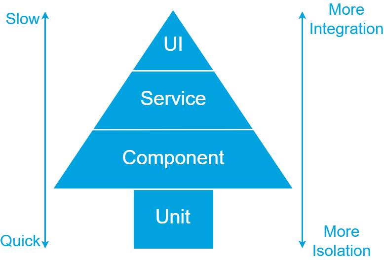

In my software development projects we use Specification by Example to explore and document the specifications of the applications to build. We use Gherkin to describe the specifications and [SpecFlow](https://specflow.org) to execute them. Resulting in a suite of automated (acceptance) tests.

As with all automated tests, there are different layers in the test pyramid at which a Gherkin scenario can be automated using SpecFlow (or Cucumber). In this blog post I explore the different layers and describe my preferred layer for SpecFlow tests. 

The insights I share are based on my own experience and inspired by other sources like [Martin Fowler's Blog](https://martinfowler.com/tags/testing.html).

### Table of Contents

- [Test Pyramid](#test-pyramid)
  - [UI Tests](#ui-tests)
  - [Service Tests](#service-tests)
  - [Unit Tests](#unit-tests)
- [Test Pyramid Extended](#test-pyramid-extended)
  - [Component Tests](#component-tests)
- [Gherkin scenario test layer](#gherkin-scenario-test-layer)
  - [Why I skip the Controller](#why-i-skip-the-controller)
  - [Why I include the repository and database](#why-i-include-the-repository-and-database)
- [Conclusion](#conclusion)

### Test Pyramid

The classis test pyramid, as show in the image below, has three layers: UI, Service and Unit.


The higher the layer in the pyramid, the higher the integration and coverage of your tests. But tests will also be slower and more fragile. The lower the layer in the pyramid, the higher the isolation, speed, and stability of your tests. The coverage per test will be lower though.

Considering these factors, it is recommended to have automated tests covering all layers. Most tests should be automated on the lowest layer. Fewer tests will be automated on the Service layer and even less on the UI layer. By following this approach, we create a balance between comprehensive test coverage and efficient test execution. 

Let's first recap the test pyramids key layers.

#### UI Tests

UI tests are end-to-end tests that interact with the system under test through the UI. These tests simulate a user interacting with the UI of the system.

Everything in the following diagram is included in the scope of a UI test.


In our example we have a separate UI that uses two internal APIs that are part of our system. Both APIs have their own database. The UI and the Order API also communicate with a ZIP Code API of an external third party.

When automating tests at the UI layer, all these components are included in the scope of coverage.

Pros:
- Initially easy to setup with 'record & playback' tools.
- Coverage per test is high because it covers the UI, underlying services, databases, etc.

Cons:
- Slow, resulting in long build and release times.
- Fragile. These tests often break due to environment related issues. Like a database that is temporary timing out, an external API that is unavailable or an UI-element that can't be found.
- Both the UI and underlying services need to be deployed before running these tests. As a result, these tests can only be executed in a release pipeline after deployment on an environment.
- Difficult to maintain because there is a lot to consider. You have to not only consider the UI, but also the available data in the databases and external services, among others.

Because of the disadvantages, I usually keep the number of UI tests to a minimum. I use them as smoke tests to check if the deployment of the UI was successful and to test if the integration with underlying services works. I do this by automating the most important user scenarios and core processes.

> NOTE: these tests should not be confused with unit tests that test a small part of the code in the UI. When performing unit tests, all external dependencies are replaced by doubles. See [Unit Tests](#unit-tests) for more info.

#### Service Tests

Service tests skip the UI and talk directly to the underlying services. They interact with a REST API or send messages to an Azure Service Bus, for example.

The scope of these tests can cover a single service or a combination of multiple services as shown in the following diagram.


When testing the Product API in our example, the scope would only be the Product API and its database. The Order API has more dependencies, so a test interacting with the Order API would also cover parts of the Product and ZIP Code API.

Pros:
- Avoids dealing with the complexity that comes with UI test automation.
- Still covers a large part of the application per test.

Cons:
- Generally faster than UI tests, but still slow compared to unit tests.
- Can be fragile when the service under test has dependencies to other services.
- Because of the external dependencies, the service(s) must be deployed on an environment. So, these tests can only be performed in a release pipeline.

I like to use service test when UI tests are too difficult to setup or to test smaller parts of larger processes. They are also great as a smoke test.

#### Unit Tests

A unit test tests a single method or class. External dependencies are replaced by test doubles.

Pros:
- Easy to create because of the small scope, making them easier to understand and maintain.
- Fast, because they run in-process.
- Can be run in an automated build pipeline and on a local development machine without requiring a deployment.

Cons:
- Does not test the integration between different parts of an application.
- Sensitive to change when the code under test is refactored.

As the classic test pyramid suggest, the bulk of your tests would normally be on this layer. Keep in mind, though, that it is possible to achieve 100% test coverage with only unit tests, yet still have an application that does not function properly due to the lack of integration between its components.

### Test Pyramid Extended

Considering the three layers of the classic test pyramid in relation to automating Gherkin scenarios, the scope of a unit test is often to narrow. Gherkin scenarios typically describe functionality that is implemented through the collaboration of multiple classes and methods. With proper focus, these scenarios tend to cover functionality within a single service or API, making the scope of UI and service tests too broad. Therefore, I introduce an additional layer in the test pyramid, as depicted below.


#### Component Tests

As described by Martin Fowler in [ComponentTest](https://martinfowler.com/bliki/ComponentTest.html), a component test limits the scope to a portion of the system under test. They can be as large or small as you define your component's size and will replace external dependencies with test doubles.

For me, a component test is executed in-process, like a unit test, but it covers a larger scope where several classes collaborate together. 

The diagram below illustrates the general structure of a (.NET) Web API. The entry point is a _Controller_ that defines operations on the API. It communicates with application logic through a _Service_ class. Database interaction is handled by an ORM like Entity Framework, abstracted away with the _Repository_ pattern.


Because a component test can be as large or small as you define your component's size, it can either cover all parts shown in the diagram above or subset.

Pros:
- Fast, because they run in-process.
- Can be run in an automated build pipeline and on a local development machine without requiring a deployment.
- Less susceptible to changes during refactoring compared to unit tests.

Cons:
- The scope they test is larger than that of unit tests. This makes them more difficult to maintain, but still considerably easier when compared to Service and UI tests.

> NOTE: to keep my component tests fast, I tend to use an in-memory version of the database. Entity Framework not only supports SQL Server, but also has an in-memory provider and a SQLite provider that are designed with test automation in mind. See [Testing without your production database system](https://learn.microsoft.com/en-us/ef/core/testing/testing-without-the-database) for more information.

### Gherkin scenario test layer

I find the component test layer ideal for automating most Gherkin scenarios. Their scope is not too small, as it usually is with unit tests, and I still get the advantages of in-process tests.

When you automate most of your scenarios at the component layer, the need for having a lot of unit tests decreases. The test pyramid will become a test tree as shown in the image below.



When I automate scenarios with SpecFlow I use the scope illustrated in the diagram below. As you can see, I tend to skip the Controller and include the database.


#### Why I skip the Controller

It is not uncommon for an API to support multiple versions of a contract or different protocols, like REST and gRPC. This would result in multiple Controllers, that all use the same application or business logic, as displayed below.


Which Controller would you use to automate your Gherkin scenario? Or would you duplicate the scenarios and implement them on every Controller?

In my opinion, Controllers should be focused on technology specific concerns, like what status code to return from a REST API if a resource can't be found. It is the application and business logic, working together with the other code, that actually implement the functionality described by a Gherkin scenario. That's why I skip the Controllers in my SpecFlow scenarios.

> NOTE: if the functionality differs between API versions, they won't share the same application logic. In that case it makes sense to create separate scenarios for each version.

#### Why I include the repository and database

Most of the logic described in a Gherkin scenario is located in the application and business logic, as well as in the aggregates and entities. So, I previously did not include the repository or database in my test’s scope. Instead, I replaced the repository with a test double.

There are two reasons why I have found this approach to be inadequate.

##### Reason 1: stubbing becomes difficult when the number of different situations to support grows

One of the advantages of Gherkin is  the ability to define `Given` steps that can be reused across multiple scenarios and features. For instance, you can ensure that books are present in the system by using the following Gherkin.

```gherkin
Given the books
    | EAN           | Name                                    |
    | 9781617290084 | Specification by Example                |
    | 9781801815710 | Infrastructure as Code with Azure Bicep |
    | 9781680504989 | The Cucumber for Java Book              |
When all books are retrieved
Then ...
```

In our first scenario we might need to retrieve all books. A call to `respository.GetAllBooks()` will performed by the application logic. We have to stub this call on our test double in the `Given` step definition.

In another scenario, we might need to retrieve a single book by its EAN (European Article Number) using `respository.GetBookByEAN(ean)`. We'll have to include this call on our stub in the same `Given` step definition and we have to make sure that the correct book is returned for the specified EAN. Essentially duplicating the filter logic implemented in the repository.

As the application's functionality increases, so does the number of methods on our repository to retrieve books. Resulting in more and more setup code on our stub.

By including the repository and database in the scope of the component test, it becomes much easier to setup the data specified in a `Given` step. You can directly insert it in the database and the selection of which books to retrieve is handled by the repository.

##### Reason 2: filter logic is part of the scenario

The second reason I include the repository and database is that it's not uncommon that code in the repository or database is part of the scenario.

Take the following scenario.

```gherkin
Given the books
    | EAN           | Name                                    |
    | 9781801815710 | Infrastructure as Code with Azure Bicep |
    | 9781617290084 | Specification by Example                |
    | 9781680504989 | The Cucumber for Java Book              |
When I search books for the phrase 'Specification'
Then I expect the following book to be found
    | EAN           | Name                                    |
    | 9781617290084 | Specification by Example                |
```

We're searching for a book. This is implemented inside the repository by executing a filtered query on the database. If we had stubbed the repository, we would not be able to test the specified logic.

### Conclusion

As with all test automation, when automating scenarios with SpecFlow, it is important to consider the appropriate scope. In my experience, the component test layer is an ideal choice for automating the majority of Gherkin scenarios. Unlike unit tests, their scope is broad enough to test a complete scenario. They also offer fast feedback because they can be executed in-process on a local development machine and in an automated build pipeline, as opposed to UI and service tests.
