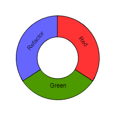

# Valkuilen als je niet TDD doet

In recente jaren is test automatisering steeds meer de norm geworden. Bedrijven moeten steeds sneller nieuwe software naar productie kunnen brengen waardoor vergaande automatisering nodig is.

Bij test automatisering zie je 2 grote stromingen. Ontwikkelaars die hun testen schrijven na het implementeren van een nieuwe feature en ontwikkelaars die dit vooraf doen.

Het vooraf schrijven van testen is een techniek die Test Driven Development wordt genoemd. Deze techniek stelt je in staat om code van hoge kwaliteit te schrijven.

De gedachte achter TDD is dat je eerst een test schrijft voordat je het bijgehorende stukje code schrijft dat door de test wordt gevalideerd. Deze test voer je uit en zal falen omdat de code nog niet is geïmplementeerd. De test is dan rood.

Nadat de test is gefaald is het tijd om de bijbehorende code te schrijven. Als hierna opnieuw de test wordt uitgevoerd zal deze moeten slagen en is hij groen.

Nu de test groen is heb je de mogelijkheid om de code te refactoren en de codekwaliteit te verbeteren. Met de test kun je verifiëren dat de code nog werkt zoals verwacht. Deze cyclus wordt ook wel Red, Green, Refactor cylus genoemd.



De cyclus wordt herhaald totdat de volledige feature is geïmplementeerd. Het resultaat is een werkend stuk software dat geautomatiseerd wordt gecontroleerd en een testdekking heeft van nagenoeg 100%.

Zelf schrijf ik al jaren op deze manier software. Het helpt mij om gefocust te werken aan de code die ik moet schrijven. Elke test is een requirement waar de code aan moet voldoen. Hierdoor kan ik stap voor stap een nieuwe feature schrijven en heb ik aan het eind code waarvan ik zeker weet dat hij doet wat hij moet doen.

Op het internet en in bladen wordt al jaren veel geschreven over TDD. Vaak over hoe het toegepast kan worden en de bovengenoemde voordelen die men ervaart. Het leek mij daarom interessant om TDD is vanuit een andere invalkshoek te bekijken en te kijken tegen welke valkuilen je aan kunt lopen wanneer je TDD niet toepast. Deze valkuilen komen voort uit ervaringen die ik in de praktijk tegen ben gekomen op verschillende projecten die ik heb gedaan en code waar ik aan heb mogen werken.

### Valkuil 1: testen die niets testen
Eén van de grootste valkuilen waar je in kunt trappen wanneer je testen achteraf schrijft is het schrijven van testen die niets testen. Ik heb meer dan eens een test geschreven die meteen groen was ondanks dat de te testen code nog niet geïmplementeerd was. Een goede indicatie dat er iets mis is met je test. Door de korte cyclus krijg je bij TDD snel feedback als je een foutje hebt gemaakt.

Wanneer je testen achteraf schrijft wordt de stap dat de test eerst faalt overgeslagen. De test kan daarom altijd groen zijn. Ook als er een fout in zit.

Neem onderstaande code als voorbeeld. Hierin wordt gecontroleerd dat wanneer een rekeningnummer wordt opgegegeven ook de tenaamstelling gevuld moet zijn. Wanneer het rekeningnummer leeg is hoeft de tenaamstelling niet gevuld te zijn.

```csharp
public bool IsTenaamstellingCorrect(string rekeningnummer, string tenaamstelling)
{
    if (rekeningnummer != null)
    {
        return (tenaamstelling != null);
    }

    return true;
}
```

De bijbehorende test om te controleren dat de tenaamstelling niet gevuld hoeft te zijn ziet er alsvolgt uit.

```csharp
[TestMethod]
public void IsTenaamstellingCorrect_Geeft_True_Terug_Indien_Rekeningnummer_Leeg_Is()
{
    bool resultaat = IsTenaamstellingCorrect(null, "J. Jansen");
    Assert.IsTrue(resultaat);
}
```

Het probleem met deze test is dat wanneer de controle `rekeningnummer != null` wordt weggehaald de test nog steeds zal slagen. Dit is niet de bedoeling.

In dit voorbeeld is het scenario onvolledig getest. De test zou eigenlijk moeten controleren dat true wordt teruggegeven als zowel rekeningnummer als tenaamstelling leeg is.

Hoewel dit een simpel voorbeeld waar je misschien snel het probleem ziet kom ik vergelijkbare situaties geregeld tegen tijdens het uitvoeren van code reviews. Wanneer TDD toegepast wordt zouden dit soort fouten eerder gevonden worden.

### Valkuil 2: code is slecht testbaar
Wanneer testen achteraf geschreven worden wordt eerst volop gefocust op de werking van de nieuw te schrijven feature. Hierbij wordt vaak niet stilgestaan bij de testbaarheid van de code. Als de code af is en daarna testen worden geschreven kom je er pas achter hoe lastig dit is en zul je moeten refactoren. Omdat je nog geen geautomatiseerde testen hebt om op terug te vallen wordt dit een stuk risicovoller.

Een situatie die ik in de praktijk nogal eens tegenkom is het gebruik van code uit libraries die niet testbaar zijn opgezet. Een voorbeeld hiervan uit de ASP.NET wereld is bijvoorbeeld het HttpContext object. Deze wordt door ASP.NET gevuld met gegevens en in code vaak als singleton gebruikt. Vanuit unit testen is het echter vaak erg lastig om deze te vullen op een manier zoals ASP.NET dit zou doen.

Bij het toepassen van TDD ben je vanaf begin af aan bezig met het testen van de code die je schrijft. Je loopt meteen tegen eventuele problemen aan zoals bij het gebruik van de HttpContext en kan deze snel oplossen. Alle code die je daarna schrijft heeft hier weer voordeel van.

## Onvoldoende testdekking
Naast de focus die TDD legt op de te implementeren functionaliteit door test voor test te werk te gaan is een van de andere grote voordelen de hoge mate van testdekking (ook wel code coverage genoemd). Doordat je eerst een test schrijft en pas daarna de bijgehorende code is het relatief simpel om een code coverage percentage van boven de 95% te halen.

Nu is code coverage geen doel op zich, maar hoe hoger het percentage, hoe meer vertrouwen je kunt hebben dat bij wijzigingen geen regressie optreedt. Hier moet wel bij gezegd worden dat de kwaliteit van je testen ook belangrijk is.

Als code coverage een doel opzich is worden er nog wel eens testen geschreven die alle code paden raken, maar vervolgens niets controleren. Om dit tegen te gaan kan een mutation testing framework ingezet worden. Een onderwerp op zich waar ik nu niet verder op in ga. Voor meer informatie kun je kunnen kijken op https://stryker-mutator.io/. Een open source tool dat door collega’s is geschreven.

### Valkuil 3: testen worden geschreven op basis van al geïmplementeerde code
Eén van de meest voorkomende valkuilen als het om onvoldoende testdekking gaat is dat testen worden geschreven op basis van de al bestaande code. Hierbij wordt een analyse gemaakt van de geschreven code en worden op basis daarvan scenario’s gekozen die geautomatiseerd worden getest. Hierbij wordt vaak niet nagedacht over alle requirements die mogelijk ook relevant zijn, maar niet zijn geïmplementeerd. Het code voorbeeld bij valkuil 1 is hier een mooi voorbeeld van.

Bij TDD werk je test voor test de verschillende requirements af die je moet implementeren. Hierdoor zie je dat veel meer van deze requirements worden geverifieerd door een test. Dit resulteert uiteindelijk in een betere testdekking.

### Valkuil 4: het schrijven van testen wordt afgeraffeld 
Eén van de meest vervelende klusjes die ik in het verleden als ontwikkelaar heb mogen doen is het schrijven van testen voor de code die iemand anders heeft geschreven.

Ik zie het schrijven van nieuwe software is een creatief proces. En weinig klusjes in software ontwikkeling zijn minder creatief dan het schrijven van testen achteraf. Het creatieve proces van software schrijven is al voorbij en het enig wat nog gedaan moet worden is controleren dat het werkt.

Je ziet hierdoor dat de minimale set aan testen wordt geschreven zodat de code coverage richtlijn wordt gehaald. Voldoende testdekking van de relevante scenario’s krijg je hierdoor vaak niet.

Bij TDD wordt het schrijven van testen onderdeel van eht creatieve proces. Hierdoor blijf het werk continu interessant en is het geen naar klusje meer dat achteraf moet worden uitgevoerd.

### Valkuil 5: testen worden helemaal niet geschreven
Als er druk op de ketel staat en testen worden achteraf geschreven zullen deze een van eerste slachtoffers zijn. Ze worden vaak uitgesteld om in een volgende sprint opgepakt te worden en later misschien nooit geschreven. Het risico op bugs zal hierdoor bij wijzigingen in de toekomst veel hoger zijn. Bij TDD zou dit nooit gebeuren.

Daarnaast bestaat vooral bij managers en projectleiders nog wel eens de illusie dat het überhaupt schrijven van testen alleen maar tijd kost. Mijn ervaring is dat TDD juist tijdwinst oplevert. Bij het bouwen van de functionaliteit wordt code niet alleen direct getest, maar ook vaak en snel. Met handmatig testen zou dit velen malen meer tijd kosten.

## Conclusie
TDD is een techniek die naar mijn menig iedere ontwikkelaar zou moeten beheersen. Omdat het denkproces net iets anders in elkaar steekt is het soms lastig om te starten. Maar als je deze techniek eenmaal onder de knie hebt kan het je veel voordelen opleveren.

TDD biedt een oplossing om verschillende valkuilen te vermijden. Zeker als kwaliteit en snelheid van belang zijn is test automatisering een must waarbij het onderste uit de kan kunt halen als je TDD toepast.